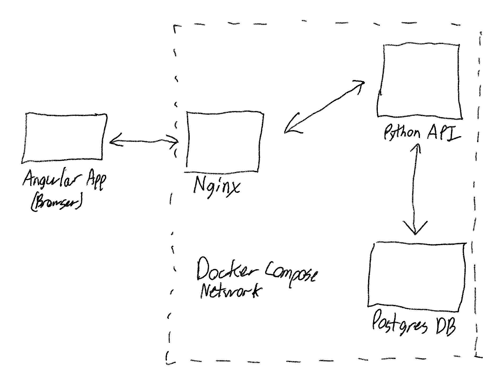
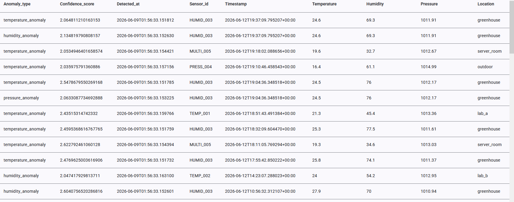
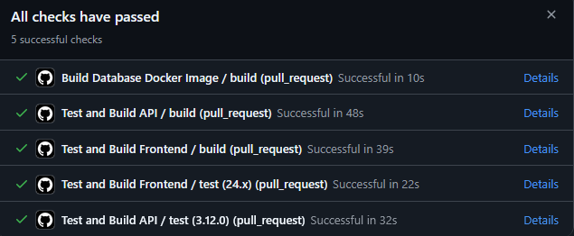

# Sensor Data Pipeline Example

This repo contains a system that can receive batches of sensor readings, perform anomaly detection on them, store them, and retrieve them in a web browser. Each piece of infrastructure is containerized so that it's ready to be deployed to the cloud. A Docker Compose set-up is provided to manage the containers.

## Installation
To launch the system, navigate to the `/orchestration` directory and run:
``` bash
docker compose up
```
Ensure that the environment variables referenced in `compose.yaml` are available, for example:
```
POSTGRES_PASSWORD=
DB_CONNECTION_STRING="postgresql+asyncpg://<db_user_name>:<db_password>@database:5432/<db_name>"
API_PROXY_URL="http://api:8000/"
FRONTEND_API_URL="http://localhost:80/api"
```

To test the API, launch a Python virtual environment and then, in the project root, run:
``` bash
pip install -r requirements.txt
pytest
```

To launch the API on localhost:8000, you can run this in the `./api` directory and within your virtual environment:
``` bash
fastapi dev
```

To test the frontend, install Node.js, then in `./web/anomaly-detection-frontend` run:
``` bash 
npm install
npm test
```
`npm install` should pick up the Angular CLI necessary to run the tests, but if not, you could install it globally: `npm install -g @angular/cli`.

Frontend production builds can similarly be made using:
``` bash
npm build
```

For development, the frontend can be served on localhost:4200 with `npm start` or `ng serve`.

## Components

### Database
The database is a plain relational PostgreSQL database running in a Docker container. When the system receives a new batch of sensor readings, it inserts them all into the `readings` table. If anomalies were detected, those are included as a list on the `anomalies` JSON column. The table is indexed on `timestamp` in descending order, where `anomalies is not null`, which should help make the primary use case for this example (showing the most recent anomalies) very snappy.

Now, why store anomaly information un-normalized in the `readings` table?
* I ran the anomaly detection step in-line when receiving the new batch of readings, so this doesn't have to write to two tables for each bad reading
* I decided that it would be useful to see the original sensor readings along with the anomaly flags, so this avoids a join on the way out

As a future improvement, I would consider using a timeseries database. In the real world, an application like this would likely have a real-time stream of readings coming in from many sensors, which is a perfect use case for timeseries. A timeseries database would also make it easy to query the statistics needed for anomaly detection (i.e. z score over a rolling mean). The "most recent anomalies" use case is also fast and trivial if the data is inherently stored in timestamp order.
### API
The API is a basic Python web server using the FastAPI framework. I've structured this using a three layer approach that's worked well in Node.js development in the past: Routes, Views, and Models. Each set of these should correspond to one application level concept, in this case sensor readings. These are all constructed and initialized at the app level with a "sort-of" dependency injection pattern.

These layers have the following focuses/responsibilies:
* Routes
    * Paths/methods to access resources (e.g. `GET /readings`, `POST /readings`)
    * Middleware for auth, rate limiting, high-level validation
    * Dealing directly with the HTTP Request/Response
* Views
    * Business logic
    * Caching
    * Pagination
    * Complex validation ("if the start date and end date filters are both provided and valid, is end > start?")
    * Using other Views ("does the sensor reading at `reading_id` exist for the `anomaly_id` I'm trying to attach to it?")
    * Transforming the data (from the database) to match the API contract
* Models
    * No-frills database access

This API currently provides three main routes: `GET /ping`, `POST /readings`, and `GET /readings/anomalies`.

#### POST /readings
This is the route for uploading a .csv file containing a batch of sensor readings, such as those created by `generate_data.py`. In the real world, this would likely be called autonomously by a "new file uploaded" trigger on an S3 bucket, for example. In this case, your favorite API testing tool (Postman, Insomnia, et al.) is well-suited to add new data to the system.

I decided to immediately run `anomaly_detector.py` against the data after loading it from the .csv, but before writing anything to the database. This was primarily done for convenience as we have all the information we need to do the detection step without having to talk to the database. The throughput requirements are minimal since this isn't a real-time system, and even large .csv files with a high anomaly rate are quickly handled.

In the real world where such a system could be receiving hundreds of thousands of readings a second, I would propose a deferred processing step using a queue and batch workers. In this architecture, a triggering event, such as a batch of new data, would add a job to a queue. Then, worker nodes from a pool of compute resources would routinely pull jobs out of the queue, execute them, and write the results to the database. This would allow the public API to stay responsive while offloading the resource-intensive work to infrastructure that is easily scaled.

#### GET /readings/anomalies
This route delivers the main use case for the application ("get the most recent anomalies"). Notice how the View and Model are equipped to get all readings from the `readings` table with any combination of search filters. The Route is able to implement a specific `GET /readings/anomalies` route by calling the View in a specific way. Other routes like `GET /sensors/{sensor_id}/readings` or just `GET /readings` could be implemented with the same code.
### Frontend
The frontend is a barebones Angular single page app that shows the most recent anomalies in a table on page load:



It fetches readings no older than one day ago from the moment the page loads. It does not dynamically update, but this would be easily achievable thanks to Angular's data binding. The parameters to the API are also fixed, but input fields could be added to allow for varying `sensor_id`, `starting_timestamp`, and `ending_timestamp`.
### Nginx Server
The Nginx server accomplishes two basic things:
* Serving the built Angular app
* Proxying requests to `/api` to the Python API

This removes the need to expose any public ports on both the API and the Database, making the Database only accessible within the Docker network, and the API only accessible though the Nginx proxy. Non `/api` routes are effectively passed back to the Angular app, allowing Angular routing to still work.
### CI/CD
The repo contains the following Github Actions that run on push or pull request to `main`:



The `build` actions are set up to only build the Docker image if the corresponding `test` action completed successfully. In a real-world scenario, the `build` actions could be extended to actually deploy the containers, likely by uploading them to a cloud Docker registry from which they would be pulled by cloud services.